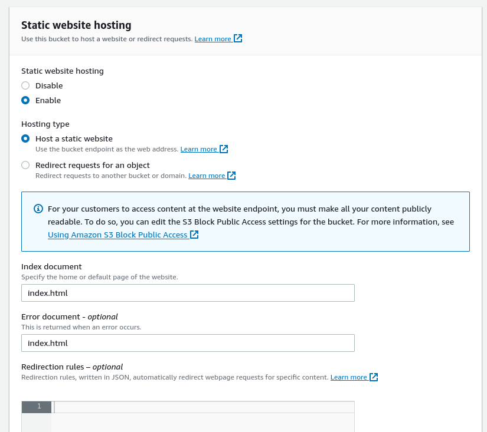

# stryker-campaign-frontend

1. For User they can follow below steps (if they're using AWS as infra)-

2. Create S3 bucket (Make it's objects publicly accessibly). 

3. Enable Static website hosting option for this bucket. Refer below image:
 

4. Upload the files/folders from /build content on this bucket. (make sure index.html file should be on root folder)

5. Create distribution on Cloud front using above S3 bucket as origin name to host the website content. 
    Use these settings - 	
	    Origin or origin group -  Above S3 bucket aws address - i.e bucket-name.s3.us-east-2.amazonaws.com
	    Viewer protocol policy - Redirect HTTP to HTTPS
	    Cache policy name - Managed-CachingOptimized
    (Once deployment is completed you'll recieve the Distribution domain name, using that app can be accessed.)

6. OPTIONAL - Update DNS (If Using a Custom Domain): If are using a custom domain, update DNS records to point to the CloudFront distribution. This involves creating a CNAME record that points to the CloudFront distribution domain.

7. Check for the permission for both cloudfront & S3, if you face any issues while accessing.

8. Build the React code for uploading on s3 bucket. The following command gives you build folder containig all the files for the react code.

```bash
npm run build
```

9. Go to S3 bucket click on upload and select upload Folder.

10. select stryker-campaign-frontend/build folder, Then move the all the files of build to root of S3 bucket.

11. Go to S3 buckets properties tab and check for Static website hosting.

12. Bucket website endpoint give link for website.
